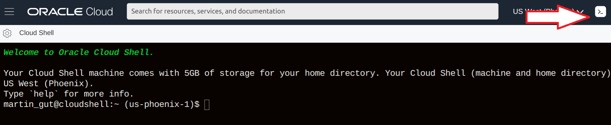
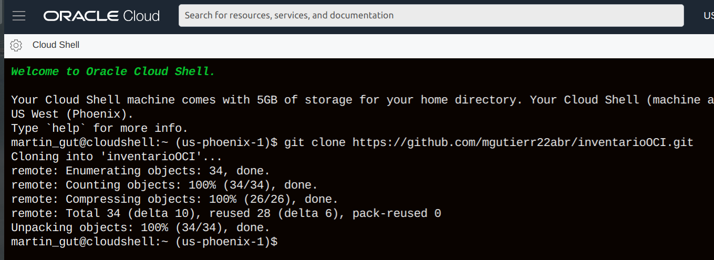
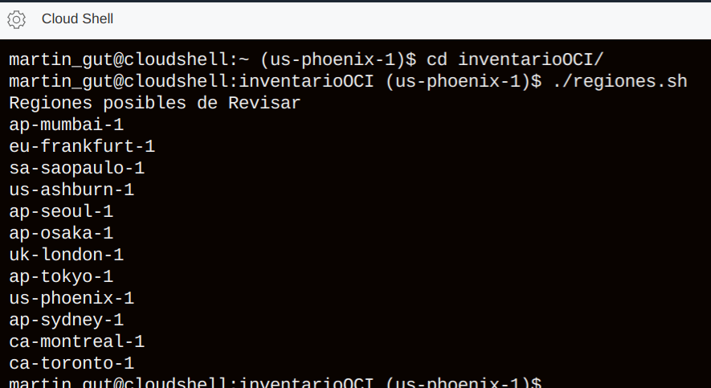
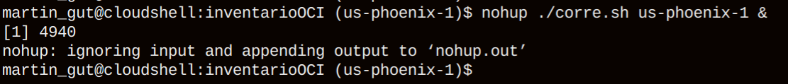
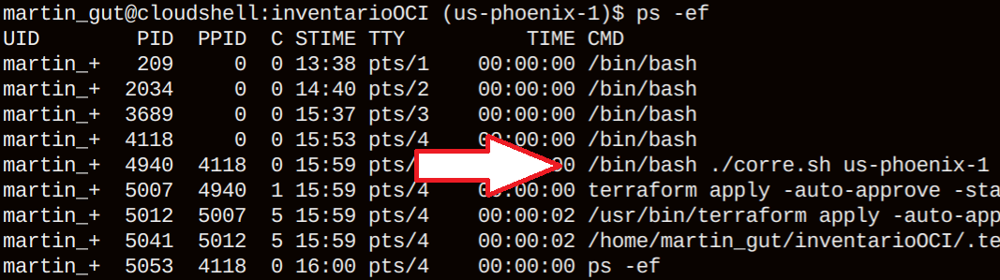
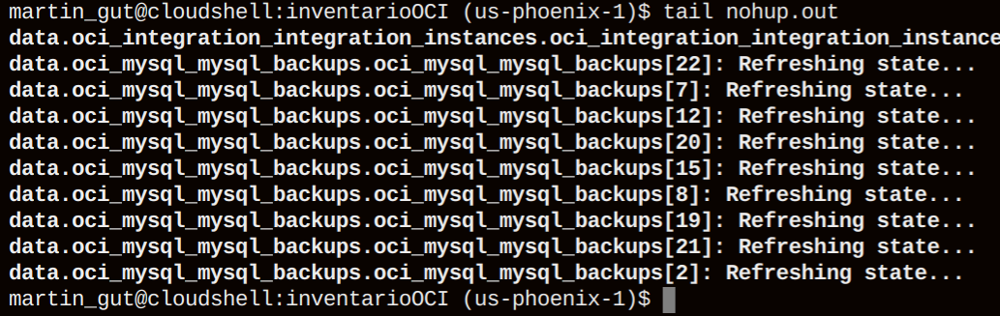
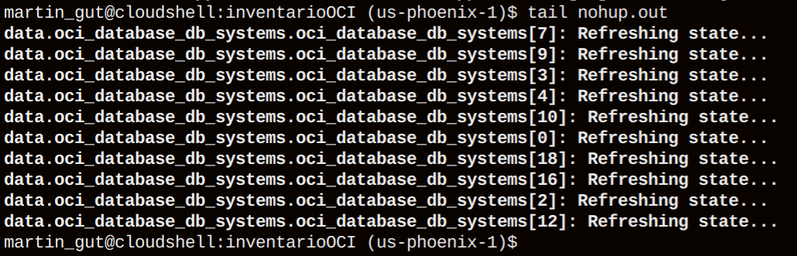
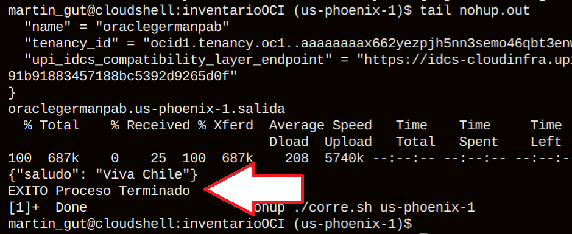
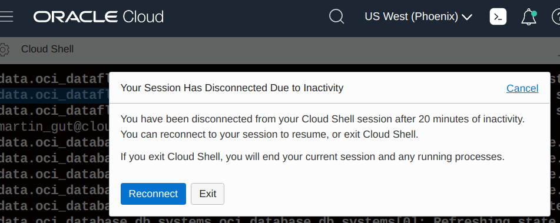

# inventarioOCI
Obtiene el inventario de un tenancy OCI

Para generar, primero hay que ingresar a la consola OCI con un usuario con privilegios para VER el tanancy
Luego hay que entrar a la Consola "Cloud Shell"

Ejecutar comando

           $ git clone https://github.com/mgutierr22abr/inventarioOCI.git

Ir al directorio y revisar regiones disponibles

           $ cd inventarioOCI
           $ ./regiones.sh

Ejecutar el inventario

           $ nohup ./corre.sh us-phoenix-1 &

Verificar Ejecución en proceso de "corre.sh"

           $ ps -ef 

Verificar Resultado/Estado (Mensaje EXITO)

           $ tail nohup.out

Esperar hasta que aparezca mensaje de EXITO

NOTA: No cerrar el browser
si entrega mensaje de inactividad, simplemente reconectarse

Una vez reconectado, volver al directorio y verificar estado

           $ cd inventarioOCI
           $ ps -ef
           $ tail nohup.out
