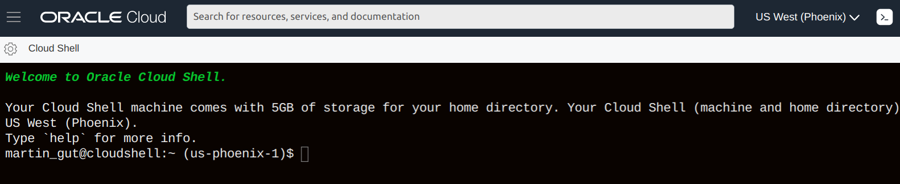
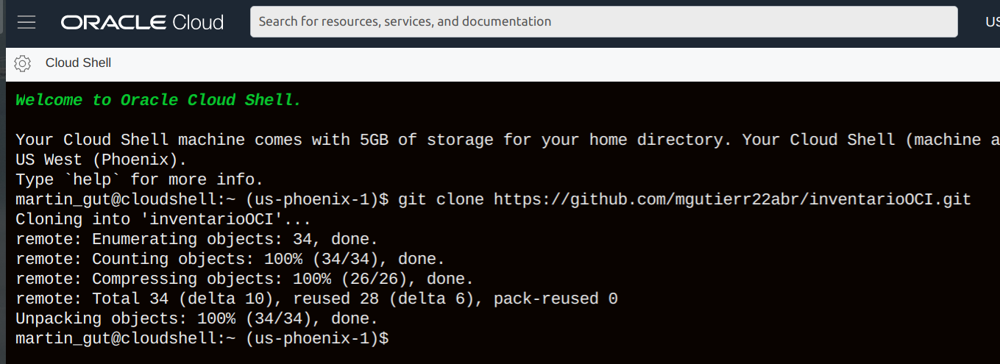
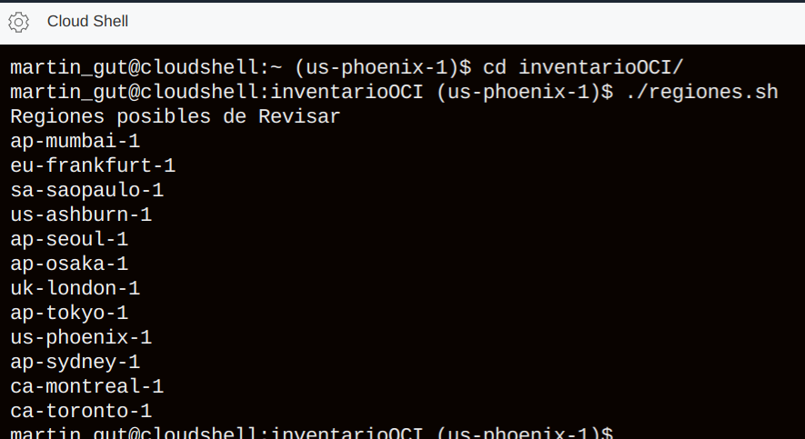
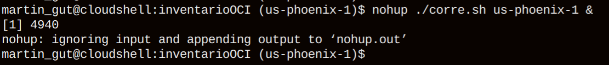
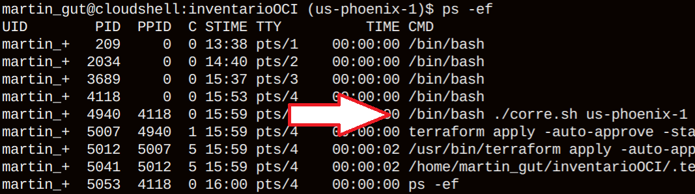
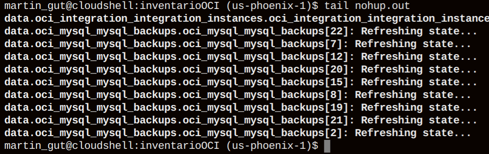
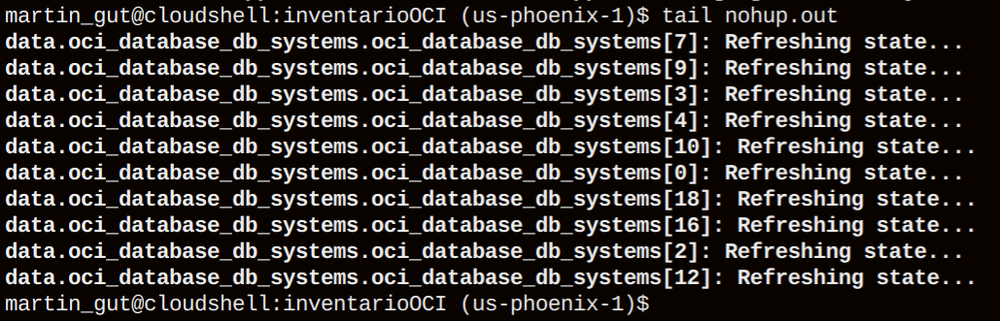
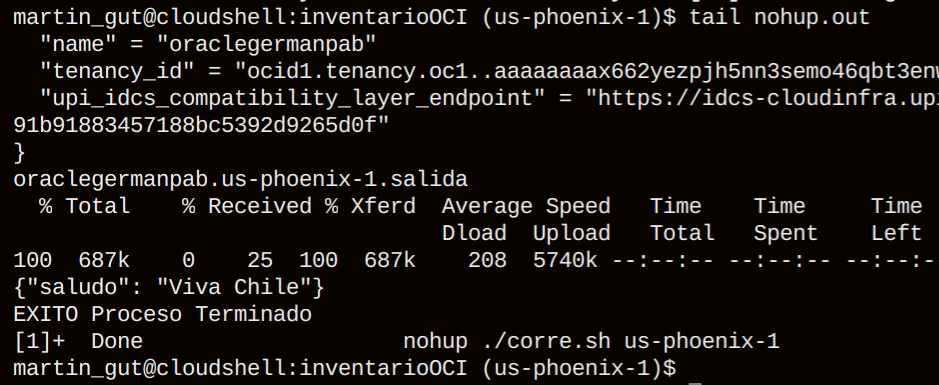

# inventarioOCI
Obtiene el inventario de un tenancy OCI

Ejecutar comando
git clone https://github.com/mgutierr22abr/inventarioOCI.git

Ir al directorio y revisar regiones disponibles
cd inventarioOCI
./regiones.sh

Ejecutar el inventario

nohup ./corre.sh us-phoenix-1 &

Verificar Ejecución en proceso de "corre.sh"

ps -ef 

Verificar Resultado/Estado (Mensaje EXITO)

tail nohup.out

Esperar hasta que aparezca mensaje de EXITO

NOTA: No cerrar el browser
si entrega mensaje de inactividad, simplemente reconectarse



